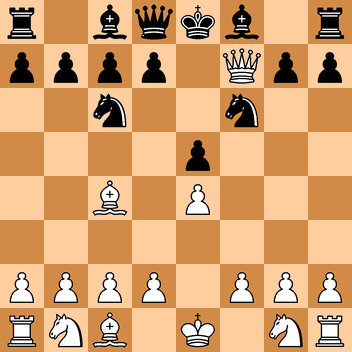

# FsChessPgn: a library for chess scripting using F#

## Introduction

FsChessPgn is a library for scripting in F# that provides chess facilities such as move generation, move validation and support for common chess formats such as FEN and PGN.

It is intended to be similar to the excellent [python-chess](https://github.com/niklasf/python-chess). This library is useful if you want to use F# rather than Python.

This is the Scholar's mate in FsChessPgn:

```fsharp
#load "setup.fsx"
open FsChess

let board = Board.Start

let mvs = board|>Board.AllMoves

let nbd = 
    board
    |>Board.PushSAN "e4"
    |>Board.PushSAN "e5"
    |>Board.PushSAN "Qh5"
    |>Board.PushSAN "Nc6"
    |>Board.PushSAN "Bc4"
    |>Board.PushSAN "Nf6"
    |>Board.PushSAN "Qxf7"

let ismate = nbd|>Board.IsCheckMate
```

This produces these results in F# Interactive:

```
val board : FsChess.Types.Brd =
  rnbqkbnr/pppppppp/8/8/8/8/PPPPPPPP/RNBQKBNR w KQkq - 0 1
val mvs : FsChess.Types.Move list =
  [h2h4; g2g4; f2f4; e2e4; d2d4; c2c4; b2b4; a2a4; h2h3; g2g3; f2f3; e2e3;
   d2d3; c2c3; b2b3; a2a3; g1h3; g1f3; b1c3; b1a3]
val nbd : FsChess.Types.Brd =
  r1bqkb1r/pppp1Qpp/2n2n2/4p3/2B1P3/8/PPPP1PPP/RNB1K1NR b KQkq - 0 4
val ismate : bool = true
```

## Detailed Documentation

* [Core](https://github.com/pbbwfc/FsChessPgn) - *TODO*
* [PGN parsing and writing](https://github.com/pbbwfc/FsChessPgn) - *TODO*

## Features

* Witten using .NET Core and designed to use the latest version of F# Interactive.

* Generates images of a Board in PNG format. We can use this script:

```fsharp
#load "setup.fsx"
open FsChess

let board = "r1bqkb1r/pppp1Qpp/2n2n2/4p3/2B1P3/8/PPPP1PPP/RNB1K1NR b KQkq - 0 4"|>Board.FromStr

do board|>Board.ToPng "c:/temp/fools.png" false
```
This produces this image:




* Can make moves given a Board. Can both make and unmake moves given a Game.

```fsharp
#load "setup.fsx"
open FsChess

//Board code
let board = Board.Start

let new_board = board|>Board.PushSAN "e4"|>Board.PushSAN "e5"

//Game code
let game = Game.Start

let new_game = game|>Game.PushSAN "e4"|>Game.PushSAN "e5"|>Game.PushSAN "Nf3"

let reduced_game = new_game|>Game.Pop
```

This produces these results in F# Interactive:

```
val board : FsChess.Types.Brd =
  rnbqkbnr/pppppppp/8/8/8/8/PPPPPPPP/RNBQKBNR w KQkq - 0 1
val new_board : FsChess.Types.Brd =
  rnbqkbnr/pppp1ppp/8/4p3/4P3/8/PPPP1PPP/RNBQKBNR w KQkq e6 0 2
val game : FsChess.Types.Game = No moves
val new_game : FsChess.Types.Game = moves: 1. e4 e5 2. Nf3
val reduced_game : FsChess.Types.Game = moves: 1. e4 e5
```


* Show a simple ASCII board:

```fsharp

#load "setup.fsx"
open FsChess

let board = Board.FromStr("r1bqkb1r/pppp1Qpp/2n2n2/4p3/2B1P3/8/PPPP1PPP/RNB1K1NR b KQkq - 0 4")
board|>Board.Print

```

This produces these results in F# Interactive:

```
    r . b q k b . r
    p p p p . Q p p
    . . n . . n . .
    . . . . p . . .
    . . B . P . . .
    . . . . . . . .
    P P P P . P P P
    R N B . K . N R
val it : unit = ()
```

* Detects checkmates and stalemates:

```fsharp

#load "setup.fsx"
open FsChess

let board = Board.FromStr("r1bqkb1r/pppp1Qpp/2n2n2/4p3/2B1P3/8/PPPP1PPP/RNB1K1NR b KQkq - 0 4")
let chk1 = board|>Board.IsCheckMate
let chk2 = board|>Board.IsStaleMate

```

This produces these results in F# Interactive:

```
val board : Brd =
  r1bqkb1r/pppp1Qpp/2n2n2/4p3/2B1P3/8/PPPP1PPP/RNB1K1NR b KQkq - 0 4
val chk1 : bool = true
val chk2 : bool = false
```

* Detects checks and attacks:

```fsharp

#load "setup.fsx"
open FsChess

let board = Board.FromStr("r1bqkb1r/pppp1Qpp/2n2n2/4p3/2B1P3/8/PPPP1PPP/RNB1K1NR b KQkq - 0 4")
let chk1 = board|>Board.IsCheck
let chk2 = board|>Board.SquareAttacked E8 Player.White
let attackers = board|>Board.SquareAttackers F3 Player.White

```

This produces these results in F# Interactive:

```
val board : FsChess.Types.Brd =
  r1bqkb1r/pppp1Qpp/2n2n2/4p3/2B1P3/8/PPPP1PPP/RNB1K1NR b KQkq - 0 4
val chk1 : bool = true
val chk2 : bool = true
val attackers : FsChess.Types.Square list = [g2; g1]
```

* Parses and creates SAN representation of moves.- *TODO*

* Parses and creates FENs- *TODO*

* Reads and writes PGNs. Supports headers, comments, NAGs and a tree of variations. - *TODO*

## Installing

Please just download a copy of the code from GitHub and then start using any of the sample scripts. 