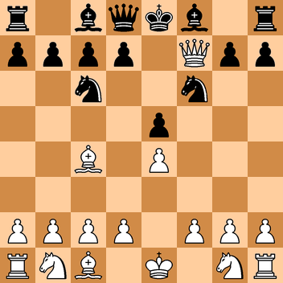

[Home](https://pbbwfc.github.io/FsChessPgn)  [Types](https://pbbwfc.github.io/FsChessPgn/Types)  [Core Functions](https://pbbwfc.github.io/FsChessPgn/Core)  [PGN Functions](https://pbbwfc.github.io/FsChessPgn/Pgn)

# FsChessPgn: a library for chess scripting using F#

## Introduction

FsChessPgn is a library for scripting in F# that provides chess facilities such as move generation, move validation and support for common chess formats such as FEN and PGN.

It is intended to be similar to the excellent [python-chess](https://github.com/niklasf/python-chess). This library is useful if you want to use F# rather than Python.

This is the Scholar's mate in FsChessPgn:

```fsharp
#load "setup.fsx"
open FsChess

let board = Board.Start

let mvs = board|>Board.AllMoves

let nbd = 
    board
    |>Board.PushSAN "e4"
    |>Board.PushSAN "e5"
    |>Board.PushSAN "Qh5"
    |>Board.PushSAN "Nc6"
    |>Board.PushSAN "Bc4"
    |>Board.PushSAN "Nf6"
    |>Board.PushSAN "Qxf7"

let ismate = nbd|>Board.IsCheckMate
```

This produces these results in F# Interactive:

```
val board : FsChess.Types.Brd =
  rnbqkbnr/pppppppp/8/8/8/8/PPPPPPPP/RNBQKBNR w KQkq - 0 1
val mvs : FsChess.Types.Move list =
  [h2h4; g2g4; f2f4; e2e4; d2d4; c2c4; b2b4; a2a4; h2h3; g2g3; f2f3; e2e3;
   d2d3; c2c3; b2b3; a2a3; g1h3; g1f3; b1c3; b1a3]
val nbd : FsChess.Types.Brd =
  r1bqkb1r/pppp1Qpp/2n2n2/4p3/2B1P3/8/PPPP1PPP/RNB1K1NR b KQkq - 0 4
val ismate : bool = true
```

## Features

* Witten using .NET Core and designed to use the latest version of F# Interactive.

* Generates images of a Board in PNG format. We can use this script:

```fsharp
#load "setup.fsx"
open FsChess

let board = "r1bqkb1r/pppp1Qpp/2n2n2/4p3/2B1P3/8/PPPP1PPP/RNB1K1NR b KQkq - 0 4"|>Board.FromStr

do board|>Board.ToPng "c:/temp/fools.png" false
```
This produces this image:




* Can make moves given a Board. Can both make and unmake moves given a Game.

```fsharp
#load "setup.fsx"
open FsChess

//Board code
let board = Board.Start

let new_board = board|>Board.PushSAN "e4"|>Board.PushSAN "e5"

//Game code
let game = Game.Start

let new_game = game|>Game.PushSAN "e4"|>Game.PushSAN "e5"|>Game.PushSAN "Nf3"

let reduced_game = new_game|>Game.Pop
```

This produces these results in F# Interactive:

```
val board : FsChess.Types.Brd =
  rnbqkbnr/pppppppp/8/8/8/8/PPPPPPPP/RNBQKBNR w KQkq - 0 1
val new_board : FsChess.Types.Brd =
  rnbqkbnr/pppp1ppp/8/4p3/4P3/8/PPPP1PPP/RNBQKBNR w KQkq e6 0 2
val game : FsChess.Types.Game = No moves
val new_game : FsChess.Types.Game = moves: 1. e4 e5 2. Nf3
val reduced_game : FsChess.Types.Game = moves: 1. e4 e5
```


* Show a simple ASCII board:

```fsharp

#load "setup.fsx"
open FsChess

let board = Board.FromStr("r1bqkb1r/pppp1Qpp/2n2n2/4p3/2B1P3/8/PPPP1PPP/RNB1K1NR b KQkq - 0 4")
board|>Board.Print

```

This produces these results in F# Interactive:

```
    r . b q k b . r
    p p p p . Q p p
    . . n . . n . .
    . . . . p . . .
    . . B . P . . .
    . . . . . . . .
    P P P P . P P P
    R N B . K . N R
val it : unit = ()
```

* Detects checkmates and stalemates:

```fsharp

#load "setup.fsx"
open FsChess

let board = Board.FromStr("r1bqkb1r/pppp1Qpp/2n2n2/4p3/2B1P3/8/PPPP1PPP/RNB1K1NR b KQkq - 0 4")
let chk1 = board|>Board.IsCheckMate
let chk2 = board|>Board.IsStaleMate

```

This produces these results in F# Interactive:

```
val board : Brd =
  r1bqkb1r/pppp1Qpp/2n2n2/4p3/2B1P3/8/PPPP1PPP/RNB1K1NR b KQkq - 0 4
val chk1 : bool = true
val chk2 : bool = false
```

* Detects checks and attacks:

```fsharp

#load "setup.fsx"
open FsChess

let board = Board.FromStr("r1bqkb1r/pppp1Qpp/2n2n2/4p3/2B1P3/8/PPPP1PPP/RNB1K1NR b KQkq - 0 4")
let chk1 = board|>Board.IsCheck
let chk2 = board|>Board.SquareAttacked E8 Player.White
let attackers = board|>Board.SquareAttackers F3 Player.White

```

This produces these results in F# Interactive:

```
val board : FsChess.Types.Brd =
  r1bqkb1r/pppp1Qpp/2n2n2/4p3/2B1P3/8/PPPP1PPP/RNB1K1NR b KQkq - 0 4
val chk1 : bool = true
val chk2 : bool = true
val attackers : FsChess.Types.Square list = [g2; g1]
```

* Parses and creates SAN representation of moves:


```fsharp

#load "setup.fsx"
open FsChess

let board = Board.Start
let mv = "e4"|>Move.FromSan board
let uci = mv|>Move.ToUci
let san = mv|>Move.ToSan board
let mv2 = "Nf3"|>Move.FromSan board
let uci2 = mv2|>Move.ToUci
let san2 = mv2|>Move.ToSan board

```

This produces these results in F# Interactive:

```
val board : Brd = rnbqkbnr/pppppppp/8/8/8/8/PPPPPPPP/RNBQKBNR w KQkq - 0 1
val mv : Move = e2e4
val uci : string = "e2e4"
val san : string = "e4"
val mv2 : Move = g1f3
val uci2 : string = "g1f3"
val san2 : string = "Nf3"
```

* Parses and creates FENs:

```fsharp

#load "setup.fsx"
open FsChess

let board = Board.Start
let fen = board|>Board.ToStr

let bd = "8/8/8/2k5/4K3/8/8/8 w - - 4 45"|>Board.FromStr
let pc = bd.[C5]

```

This produces these results in F# Interactive:

```
val board : FsChess.Types.Brd =
  rnbqkbnr/pppppppp/8/8/8/8/PPPPPPPP/RNBQKBNR w KQkq - 0 1
val fen : string = "rnbqkbnr/pppppppp/8/8/8/8/PPPPPPPP/RNBQKBNR w KQkq - 0 1"
val bd : FsChess.Types.Brd = 8/8/8/2k5/4K3/8/8/8 w - - 4 45
val pc : FsChess.Types.Piece = BKing
```


* Reads and writes PGNs. Supports headers, comments, NAGs and a tree of variations:


```fsharp

#load "setup.fsx"
open FsChess
open FsChess.Pgn

let fn = __SOURCE_DIRECTORY__ + "/data/pgn/molinari-bordais-1979.pgn"
let games = fn|>Games.ReadFromFile
let first_game = games.Head
let white = first_game.WhitePlayer
let black = first_game.BlackPlayer
let mvs = first_game.MoveText|>Game.MovesStr
let result = first_game.Result 

```

This produces these results in F# Interactive:

```
val fn : string =
  "D:\GitHub\FsChessPgn\scripts/data/pgn/molinari-bordais-1979.pgn"
val games : FsChess.Types.Game list = [moves: ...4. Nbc3 Nb4 5. g3 Nd3# 0-1]
val first_game : FsChess.Types.Game = moves: ...4. Nbc3 Nb4 5. g3 Nd3# 0-1
val white : string = "Molinari"
val black : string = "Bordais"
val mvs : string = "1. e4 c5 2. c4 Nc6 3. Ne2 Nf6 4. Nbc3 Nb4 5. g3 Nd3# 0-1"
val result : FsChess.Types.GameResult = BlackWins
```

## Installing

Please just download a copy of the code from GitHub and then start using any of the sample scripts. 