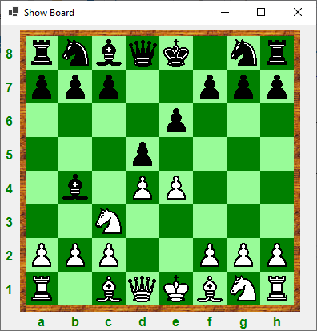
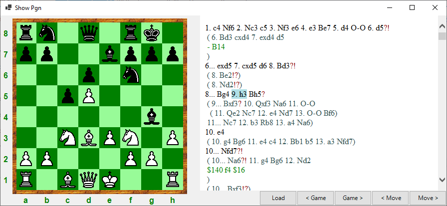

[Home](https://pbbwfc.github.io/FsChessPgn)  [Types](https://pbbwfc.github.io/FsChessPgn/Types)  [Core Functions](https://pbbwfc.github.io/FsChessPgn/Core)  [PGN Functions](https://pbbwfc.github.io/FsChessPgn/Pgn)  [WinForms](https://pbbwfc.github.io/FsChessPgn/winforms)

# WinForms UI components

The WinForms related facilities are included in the namespace _FSChess.WinForms_. 

## Board Panel

This component is a chess board panel that allows you to make legal moves. The board supports drag and drop.

It keeps track of a Board type and a list of Moves.

There is a simple example of its use - see the sample application _ShowBoard_.



It provides the following functions:

| Function        | Type                            | Description                                                                         |
|:----------------|:--------------------------------|:------------------------------------------------------------------------------------|
| SetBoard        | Brd -> unit                     | Sets the Board to be displayed                                                      |

It generates the following events:

| Event           | Type                            | Description                                                                         |
|:----------------|:--------------------------------|:------------------------------------------------------------------------------------|
| MvMade          | IEvent<Move>                    | Provides the Move made on the board                                                 |


# Pgn Game Panel

This component is a panel holding the moves of a game in PGN format.

It keeps track of a Game including headers, moves and comments.

There is a simple example of its use - see the sample application _ShowPgn_.



It provides the following functions:

| Function        | Type                            | Description                                                                         |
|:----------------|:--------------------------------|:------------------------------------------------------------------------------------|
| GetGame         | unit -> Game                    | Gets the Game that is displayed                                                     |
| SetGame         | Game -> unit                    | Sets the Game to be displayed                                                       |
| NextMove        | unit -> unit                    | Goes to the next Move in the Game                                                   |
| PrevMove        | unit -> unit                    | Goes to the previous Move in the Game                                               |
| DoMove          | Move -> unit                    | Make a Move in the Game - may change the Game or just select a Move                 |

It generates the following events:

| Event           | Type                            | Description                                                                         |
|:----------------|:--------------------------------|:------------------------------------------------------------------------------------|
| BdChng          | IEvent<Brd>                     | Provides the new Board after a change                                               |

# Link for Board and Pgn

I have also produced a slight simplification to usage by providing a function to create both a Board Panel and a Pgn Game Panel.

These are then automatically linked together so that changes in one produce changes in the other. Sample usage:

```fsharp
let bd,pgn = CreateLnkBrdPgn()
```

There is a simple example of its use - see the sample application _ShowLink_.