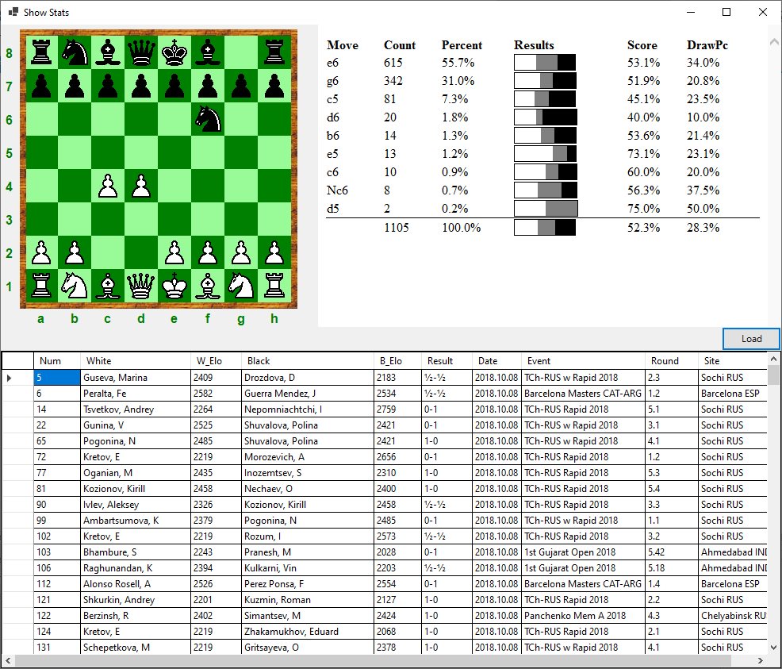

[Home](https://pbbwfc.github.io/FsChessPgn)  [Types](https://pbbwfc.github.io/FsChessPgn/Types)  [Core Functions](https://pbbwfc.github.io/FsChessPgn/Core)  [PGN Functions](https://pbbwfc.github.io/FsChessPgn/Pgn)  [WinForms](https://pbbwfc.github.io/FsChessPgn/winforms)

# WinForms UI components

The WinForms related facilities are included in the namespace _FSChess.WinForms_. 

## Board Panel

This component is a chess board panel that allows you to make legal moves. The board supports drag and drop.

It keeps track of a Board type and a list of Moves.

There is a simple example of its use - see the sample application _ShowBoard_.


It provides the following functions:

| Function        | Type                            | Description                                                                         |
|:----------------|:--------------------------------|:------------------------------------------------------------------------------------|
| SetBoard        | Brd -> unit                     | Sets the Board to be displayed                                                      |
| Orient          | bool -> unit                    | Orients the Board depending on whether White                                        |
| DoMove          | string -> unit                  | Sets the board given a new move in SAN format                                       |

It generates the following events:

| Event           | Type                            | Description                                                                         |
|:----------------|:--------------------------------|:------------------------------------------------------------------------------------|
| MvMade          | IEvent<Move>                    | Provides the Move made on the board                                                 |
| BdChng          | IEvent<Brd>                     | Provides the new Board after a change                                               |


# Pgn Game Panel

This component is a panel holding the moves of a game in PGN format.

It keeps track of a Game including headers, moves and comments.

There is a simple example of its use - see the sample application _ShowPgn_.


It provides the following functions:

| Function        | Type                            | Description                                                                         |
|:----------------|:--------------------------------|:------------------------------------------------------------------------------------|
| GetGame         | unit -> Game                    | Gets the Game that is displayed                                                     |
| SetGame         | Game -> unit                    | Sets the Game to be displayed                                                       |
| SwitchGame      | Game -> unit                    | Switches to another game with the same position                                     |
| NextMove        | unit -> unit                    | Goes to the next Move in the Game                                                   |
| LastMove        | unit -> unit                    | Goes to the last Move in the Variation                                              |
| PrevMove        | unit -> unit                    | Goes to the previous Move in the Game                                               |
| FirstMove       | unit -> unit                    | Goes to the first Move in the Variation                                             |
| DoMove          | Move -> unit                    | Make a Move in the Game - may change the Game or just select a Move                 |

It generates the following events:

| Event           | Type                            | Description                                                                         |
|:----------------|:--------------------------------|:------------------------------------------------------------------------------------|
| BdChng          | IEvent<Brd>                     | Provides the new Board after a change                                               |
| GmChng          | IEvent<Game>                    | Provides the new Game after a change                                                |
| HdrChng         | IEvent<Game>                    | Provides the new Game after a change to the header                                  |

# Link for Board and Pgn

I have also produced a slight simplification to usage by providing a function to create both a Board Panel and a Pgn Game Panel.

These are then automatically linked together so that changes in one produce changes in the other. Sample usage:

```fsharp
let bd,pgn = CreateLnkBrdPgn()
```

There is a simple example of its use - see the sample application _ShowLink_.

## Games Grid

This component is a grid showing a list of games from a PGN file filterd by a position.

It keeps track of a filtered list of Games, the selected Game and the PGN file used.

There is a simple example of its use - see the sample application _ShowGames_.


It provides the following functions:

| Function        | Type                            | Description                                       |
|:----------------|:--------------------------------|:--------------------------------------------------|
| SetBoard        | Brd -> unit                     | Sets the Board to be filtered on                  |
| SetPgn          | string -> unit                  | Sets the PGN file to be used                      |
| SavePgn         | unit -> unit                    | Saves the PGN file                                |
| SaveAsPgn       | string -> unit                  | Saves the PGN file with a new name                |
| NewGame         | unit -> unit                    | Creates a new Game                                |
| ChangeGame      | Game -> unit                    | Changes the contents of the Game that is selected |
| ChangeGameHdr   | Game -> unit                    | Changes the header of the Game that is selected   |
| DeleteGame      | unit -> unit                    | Deletes selected Game                             |
| ExportFilter    | string -> unit                  | Export filtered games                             |

It generates the following events:

| Event           | Type                               | Description                                                   |
|:----------------|:-----------------------------------|:--------------------------------------------------------------|
| FiltChng        | IEvent<(int * Game * string) list> | Provides the revised filtered list of Games                   |
| GmSel           | IEvent<Game>                       | Provides the selected Game                                    |
| PgnChng         | IEvent<Brd >                       | Provides the initial Board when the PGN file selected changes |

## Stats Panel

This component is a panel summarising the Statistics for games from a PGN file for a position.

It keeps track the stats for a position.

There is a simple example of its use - see the sample application _ShowStats_.



It provides the following functions:

| Function        | Type                               | Description                                               |
|:----------------|:-----------------------------------|:----------------------------------------------------------|
| SetStats        | BrdStats -> unit                   | Sets the Stats to be displayed                            |
| CalcStats       | (int * Game * string) list -> unit | Calculates the Stats to be displayed                      |

It generates the following events:

| Event           | Type                               | Description                                     |
|:----------------|:-----------------------------------|:------------------------------------------------|
| MvSel           | IEvent<string>                     | Provides the selected move in SAN format        |

# Link for All

I have also produced a slight simplification to usage by providing a function to create all Panels.

These are then automatically linked together so that changes in one produce changes in the others. Sample usage:

```fsharp
let bd,pgn,gms,sts = CreateLnkAll()
```

There is an example of its use - see the sample application _PgnEditor_.

